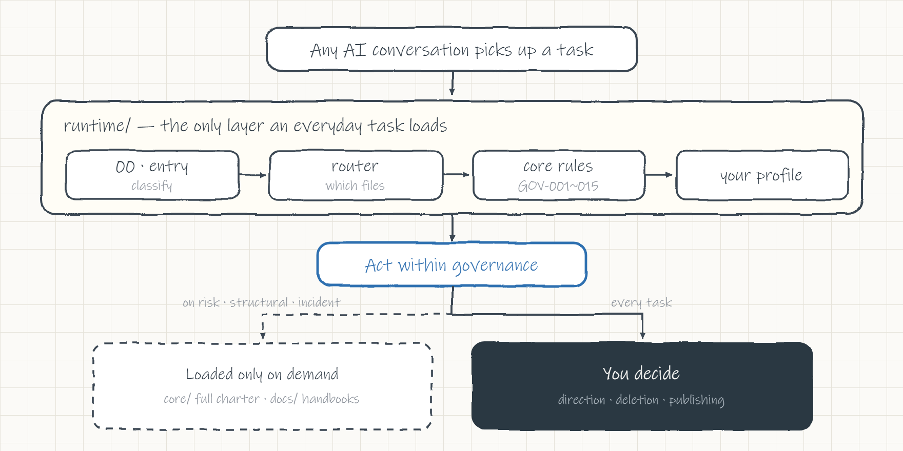
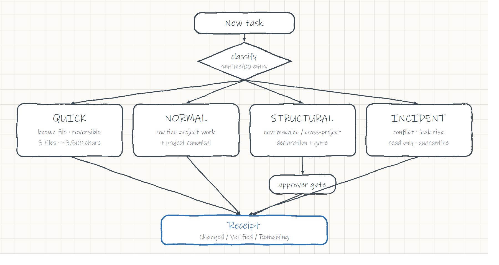

<div align="center">

# 🧭 AI Governance Framework

### One source of truth for every AI you work with — so they stop forgetting, contradicting each other, and arguing over which file is real.

[](LICENSE)
[](VERSIONS.md)
[](VERSIONS.md)
[](tools/)
[](tools/validate_runtime.py)
[](#)

**English** · [简体中文](README.zh-CN.md)

</div>

---

## The problem this solves

You don't use just one AI anymore. You use several — Claude in one window, Codex in another, a browser tab, a teammate's session. Each one:

- **forgets** what was decided last time,
- **contradicts** the other assistants,
- can't tell you **which file is authoritative**, and
- either refuses to touch anything, or quietly does something irreversible.

A smarter model doesn't fix this. **Pinning the facts into files** does — so any AI that picks up the work already knows *where to read, who decides, what is still unconfirmed, and when to stop and ask you.*

## What you actually get

|  | Without it | With this framework |
|---|---|---|
| 🔧 **Fix a typo** | AI swallows the whole 14 KB charter + all your preferences | Classified **QUICK** — reads 3 small files (~3,800 chars) and acts |
| 💻 **New computer** | "Where's the project? Who can commit? Which file is canonical?" | Method unchanged — you only re-fill *this machine's* facts |
| 💬 **Many chats at once** | They talk past each other; incidents are unexplainable | One authority order + 4-D status + gates — every conflict is traceable |
| 📋 **A progress report** | A paragraph of "I understand…" with zero evidence | Three lines: **Changed / Verified / Remaining** |
| 🔁 **Switch model / account** | memory and preferences reset every time | basic memory + personalization follow you across agents |

## Under the hood

The framework is small, and most of it is enforced by scripts rather than good intentions:

- **The always-loaded layer has a size cap.** Entry, core rules, and your profile are budgeted at 1,200 / 3,500 / 2,000 non-whitespace characters (8,000 total), and `validate_runtime.py` fails if any file goes over. The full 14 KB charter and the handbooks stay on disk and are read only when a task needs them, so routine work loads a few KB instead of the whole library.
- **Rules trace back to the charter.** The 15 `GOV-*` rules are each pinned to a source in `migration/rule-traceability.yaml` and tagged `none` (extracted verbatim) or `added` (new), so you can check that the runtime layer hasn't drifted from the charter it summarizes.
- **Three validators, 21 checks.** `validate_runtime` covers the budgets, rule uniqueness, and traceability; `validate_paths` checks that every path reference resolves and each fact has one canonical source; `validate_release` checks that the YAML parses and no stale names are left behind.
- **The "no personal info" badge is a build step.** The public repo is generated from a private source: the build scrubs identifiers, then aborts if any string on a forbidden list survives. It won't produce a copy that leaks.
- **Plain files, no dependencies.** Everything is Markdown and YAML, with no daemon, package, or runtime to install. The same files work with Claude, Codex, or a browser tab, since an agent only has to read them.
- **Versioning has three axes:** governance spec, engineering wiring, and release package, so a documentation fix isn't mistaken for a change to the rules.

## How it works — two layers, one rule

<p align="center">
  <picture>
    <source media="(prefers-color-scheme: dark)" srcset="docs/assets/architecture-dark.png">
    
  </picture>
</p>

The full charter, your complete profile, every handbook — they all exist, but **"exists ≠ must be read."** An everyday task never loads more than the runtime layer.

## Every task is classified before any heavy file opens

<p align="center">
  <picture>
    <source media="(prefers-color-scheme: dark)" srcset="docs/assets/routing-dark.png">
    
  </picture>
</p>

Unsure between two modes? Drop to the one with the smaller write surface. The moment something is irreversible, over-reaching, or touches private material, it goes straight to **INCIDENT**.

## Simplest start — let your AI set it up

Clone it, then tell your AI: **"Read `BOOTSTRAP.md` and set this framework up for me."** It reads the charter, gives you a short checklist — your role, your projects and where they live, who may commit, which guardrails — adapts the templates to your machine, and reports what's done and what still needs you.

Prefer to wire it by hand? The four steps below.

## Get started

**1 · Install it into your AI.** Clone, then drop the two skills into your agent's skills folder so any conversation can pick them up:

```bash
git clone https://github.com/yunmin311/governance-framework.git
cp -r governance-framework/skills/* ~/.claude/skills/      # Claude Code
```

Using Codex or another agent? Copy into that agent's skills directory instead — or don't install at all and just paste `launchers/总管AI-日常启动-v2.txt` into the chat.

**2 · Make it yours — the step that matters.** On disk it is still generic; adapt it so it governs *your* work:

- copy `profiles/user/user-profile.template.md` → fill in your role, **your language**, how you want reports, and what only you may decide;
- use `profiles/machines/machine-profile.template.yaml` + `projects/project-adapter.template.yaml` to record where your projects live and who may commit;
- keep these filled-in files in **your own private repo** — never push them back here.

Without this step it is just generic files on disk; with it, it governs your own work across your machines and models.

**3 · Verify.**

```bash
cd governance-framework
python -X utf8 tools/validate_runtime.py       # --- 11 passed, 0 failed ---
```

**4 · Use it.** Hand your AI any task. It classifies the task, loads only what it needs, acts within the rules, and reports back in three lines — like this:

## Watch it work

**A small task — it just does it.**

> **You:** fix that typo in the README.
>
> **AI, running under this framework:**
> 1. reads `runtime/00-entry.md` and classifies the task **QUICK** — one known file, reversible, no structural change.
> 2. loads only the runtime layer — the entry, the 15 load-bearing rules, and your profile (~3,800 chars) — and **skips** the full 14 KB charter and every handbook, because *exists ≠ must be read*.
> 3. makes the edit, re-reads the line to confirm, and hands you a three-line receipt:
>
> ```text
> Changed:   README.md line 12   "teh" → "the"
> Verified:  re-read the line; the fix is in
> Remaining: none
> ```

No preamble and no reciting the rulebook; the amount of process matches the size of the task.

**A risky task — it stops and puts the call back in your hands.**

> **You:** looks good — now delete the old `/drafts` folder and push everything public.
>
> **AI, running under this framework:**
> 1. classifies this as **not** QUICK: it trips two hard triggers — an irreversible **delete** and a **public release** (`GOV-011`).
> 2. does **not** run ahead. It stops, says exactly what it would and wouldn't touch, and returns the decision to you (`GOV-001`):
>
> ```text
> ⛔ Stopping — this is yours to decide (GOV-001 / GOV-011)
>   • delete /drafts   irreversible — I can't prove it's safe to remove
>   • push public      exposes the whole repo — publishing is your call
> Pick one:  (a) delete only   (b) publish only   (c) both — confirm
> Rollback:  /drafts is untouched on disk; nothing has been pushed.
> ```

Both cases follow the same rule: it moves quickly on small, reversible work and stops before anything irreversible, and the decision stays with you.

## The engine — a portable governor skill

The framework ships *as* a skill: [`skills/global-ai-dialogue-governor`](skills/global-ai-dialogue-governor/SKILL.md). Enable it (Claude / Codex / any agent), or paste the launcher, and any AI turns into a **governor** that, before it touches your work:

- **picks exactly one mode** — `DISCOVERY-READ-ONLY`, `NORMAL-GOVERNANCE`, or `INCIDENT-READ-ONLY` — and states what's off-limits in it;
- **loads only the layers the task needs**, routing everyday work through `runtime/` first instead of pasting the whole library into the chat;
- **keeps four state dimensions apart** — lifecycle / execution / verification / incident — and never promotes `UNKNOWN` or `DRAFT` into finished work;
- **declares role, ownership, canonical sources, and Git paths** up front, then returns a receipt of what it actually read, changed, and left;
- **scales ceremony with risk** and hard-stops for goals, irreversible actions, public release, real spending, or a hard-permission change — the calls only you should make.

One concise entry file, references one level deep. That's the whole engine — the rest of the repo is what it reads.

## It grows with you — the `growth-secretary` skill

A second skill ships alongside the governor: [`growth-secretary`](skills/growth-secretary/SKILL.md). On a weekly cadence (or on request) it reviews how you've been working, **proposes** what's worth remembering about your preferences, clarifies with you, and — only with your approval — settles the stable patterns into your profile. The system gets more personal over time and never learns behind your back.

- **Four-tier memory** (conversation → atom → scenario → persona) as plain markdown files.
- **Your memory follows you** — kept in a neutral, portable place, so switching model or account doesn't wipe it.
- **You approve what's learned** — contradicting evidence can undo a learned pattern; nothing is auto-entrenched.
- **Code memory** activates only on code work.

## Built-in guardrails

The framework corrects itself: it stops and fixes its own drift (`GOV-013`), always replies in **your** language no matter what language the documents are in (`GOV-015`), and redirects out-of-remit questions instead of overstepping (`GOV-014`).

## The 7 principles it guarantees

1. **You are the only top decision-maker** — direction, approval, deletion, publishing end with you.
2. **Documents outrank chat memory** — anything without a source is a lead, not a fact.
3. **One canonical per fact** — every kind of fact has exactly one editable source of truth.
4. **Prove the source, then state the fact** — no evidence → mark `UNKNOWN`, never hardcode.
5. **Exploration ≠ decision** — only a named approver promotes a draft to "approved."
6. **Not in the record = not done** — no artifact / verification / path / rollback means verbal-only.
7. **The governor governs, it does not rule** — coordination yes, unbounded execution no.

## Repository layout

```text
core/        governance kernel — 7 principles, 4-D status, authority order, gates
runtime/     minimal-loading layer — entry + rules GOV-001~015 + user slot + router
launchers/   per-mode starters & manual prompts   ← copy-paste ready
profiles/    user/ profile template · machines/ machine template
projects/    project-adapter protocol & template
adapters/    Claude / Codex / generic loading & hard-permission adapters
templates/   opening declaration, task package, receipt, decision record…
skills/      governor + growth-secretary skills
tools/       validators — validate_runtime / validate_paths / validate_release
docs/        deep-dive handbooks · layered-navigation guide
VERSIONS.md  three version dimensions    ·    AGENTS.md  agent entry note
```

## New machine, same method

Copy the framework as-is, re-fill only *this* machine's facts with the templates, then run `python -X utf8 tools/validate_runtime.py`. That's the whole port — the method travels, the machine facts get rediscovered, and your filled-in instances stay in **your own private repo**.

> Why the reusable layer and the machine-specific layer stay separate: see [`docs/分层导航-复用层与本机层.md`](docs/分层导航-复用层与本机层.md).

## Versioning

Three independent dimensions — **governance spec**, **engineering wiring**, **release package** — so a doc-only fix never masquerades as a spec change. See [VERSIONS.md](VERSIONS.md).

## License

[MIT](LICENSE) — temporary; may be revisited.
