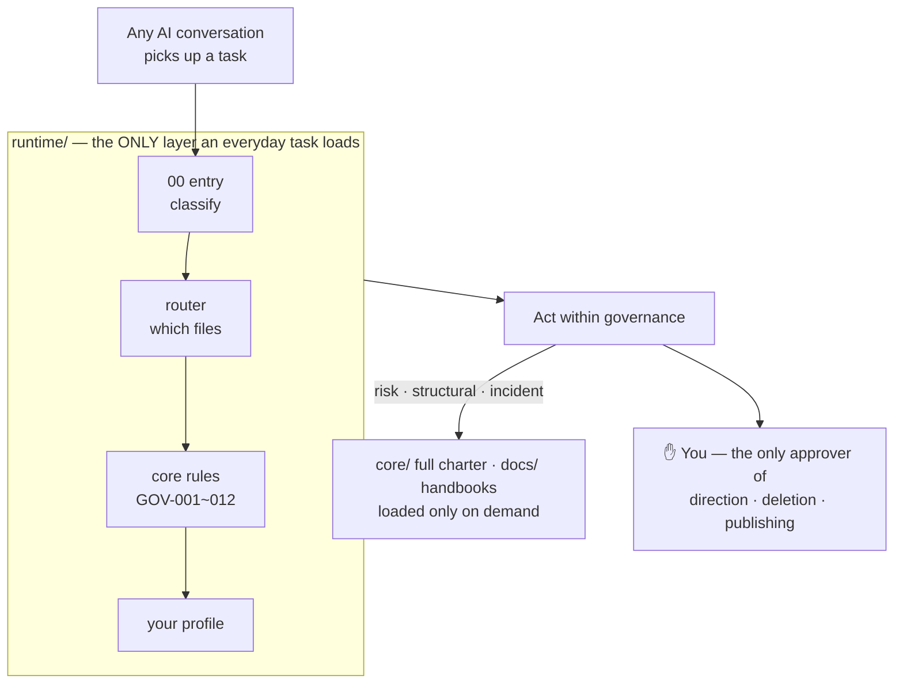
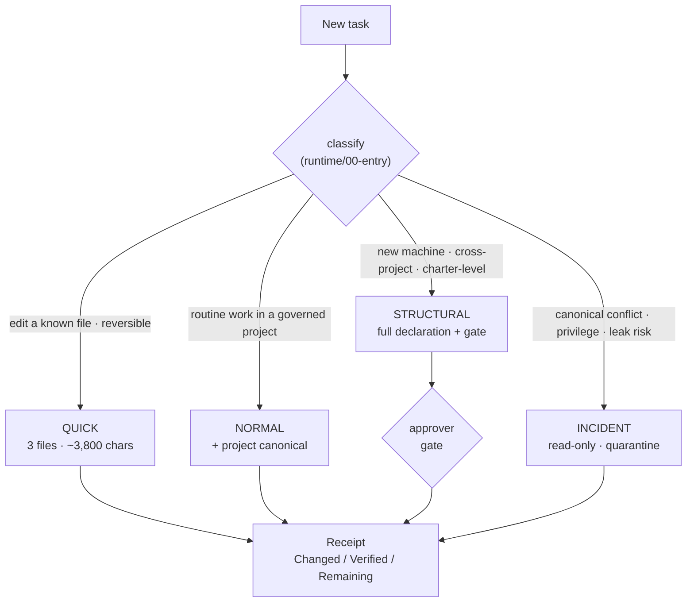

<div align="center">

# 🧭 AI Governance Framework

### One source of truth for every AI you work with — so they stop forgetting, contradicting each other, and arguing over which file is real.

[](LICENSE)
[](VERSIONS.md)
[](VERSIONS.md)
[](tools/)
[](#)

**English** · [简体中文](README.zh-CN.md)

</div>

---

## The problem this solves

You don't use just one AI anymore. You use several — Claude in one window, Codex in another, a browser tab, a teammate's session. Each one:

- **forgets** what was decided last time,
- **contradicts** the other assistants,
- can't tell you **which file is authoritative**, and
- either refuses to touch anything, or quietly does something irreversible.

A smarter model doesn't fix this. **Pinning the facts into files** does — so any AI that picks up the work already knows *where to read, who decides, what is still unconfirmed, and when to stop and ask you.*

## What you actually get

|  | Without it | With this framework |
|---|---|---|
| 🔧 **Fix a typo** | AI swallows the whole 14 KB charter + all your preferences | Classified **QUICK** — reads 3 small files (~3,800 chars) and acts |
| 💻 **New computer** | "Where's the project? Who can commit? Which file is canonical?" | Method unchanged — you only re-fill *this machine's* facts |
| 💬 **Many chats at once** | They talk past each other; incidents are unexplainable | One authority order + 4-D status + gates — every conflict is traceable |
| 📋 **A progress report** | A paragraph of "I understand…" with zero evidence | Three lines: **Changed / Verified / Remaining** |

## How it works — two layers, one rule



The full charter, your complete profile, every handbook — they all exist, but **"exists ≠ must be read."** An everyday task never loads more than the runtime layer.

## Every task is classified before any heavy file opens



Unsure between two modes? Drop to the one with the smaller write surface. The moment something is irreversible, over-reaching, or touches private material, it goes straight to **INCIDENT**.

## Quickstart — 2 minutes

```bash
git clone <your-fork-url>
cd governance-framework
python -X utf8 tools/validate_runtime.py    # prove it's real and tested
```

Real output:

```text
=== validate_runtime.py ===
  PASS runtime/00-entry.md = 821 chars (<= 1200)
  PASS runtime/01-core-rules.md = 2198 chars (<= 3500)
  PASS runtime/02-user-runtime-profile.md = 784 chars (<= 2000)
  PASS runtime total = 3803 chars (<= 8000)
  ...
--- 11 passed, 0 failed ---
```

Then paste the daily launcher into any AI — Claude, Codex, anything — and hand it one concrete task:

```text
copy launchers/总管AI-日常启动-v2.txt in full  →  paste to your AI  →  give it a task
```

## Watch it work

> **You:** fix that typo in the README.
>
> **AI, running under this framework:**
> 1. reads `runtime/00-entry.md` → classifies **QUICK** (one known file, reversible)
> 2. loads only the 3 runtime files — **does not open the full charter**
> 3. reports three lines:
>
> ```text
> Changed:   README.md line 12   "teh" → "the"
> Verified:  re-read the line to confirm
> Remaining: none
> ```

No opening ceremony, no reciting the rulebook. **Light where it should be light, hard-stop where it must stop** — only genuine risk (deletion, over-reach, publishing) escalates the mode, walks a gate, and pauses for *you*.

## The 7 principles it guarantees

1. **You are the only top decision-maker** — direction, approval, deletion, publishing end with you.
2. **Documents outrank chat memory** — anything without a source is a lead, not a fact.
3. **One canonical per fact** — every kind of fact has exactly one editable source of truth.
4. **Prove the source, then state the fact** — no evidence → mark `UNKNOWN`, never hardcode.
5. **Exploration ≠ decision** — only a named approver promotes a draft to "approved."
6. **Not in the record = not done** — no artifact / verification / path / rollback means verbal-only.
7. **The governor governs, it does not rule** — coordination yes, unbounded execution no.

## Repository layout

```text
core/        governance kernel — 7 principles, 4-D status, authority order, gates
runtime/     minimal-loading layer — entry + rules GOV-001~012 + user slot + router
launchers/   per-mode starters & manual prompts   ← copy-paste ready
profiles/    user/ profile template · machines/ machine template
projects/    project-adapter protocol & template
adapters/    Claude / Codex / generic loading & hard-permission adapters
templates/   opening declaration, task package, receipt, decision record…
skills/      the governor skill (global-ai-dialogue-governor)
tools/       validators — validate_runtime / validate_paths / validate_release
docs/        deep-dive handbooks · layered-navigation guide
VERSIONS.md  three version dimensions    ·    AGENTS.md  agent entry note
```

## Take it to a new machine (3 steps)

1. **Copy the framework as-is** — don't change a word.
2. Fill `profiles/user/user-profile.template.md` with your own profile; use the machine / project templates to re-discover *this* machine's facts. **Keep filled-in instances in your own private repo — never push them back here.**
3. `python -X utf8 tools/validate_runtime.py` to self-check.

> Why the reusable layer and the machine-specific layer stay separate: see [`docs/分层导航-复用层与本机层.md`](docs/分层导航-复用层与本机层.md).

## Versioning

Three independent dimensions — **governance spec**, **engineering wiring**, **release package** — so a doc-only fix never masquerades as a spec change. See [VERSIONS.md](VERSIONS.md).

## License

[MIT](LICENSE) — temporary; may be revisited.
