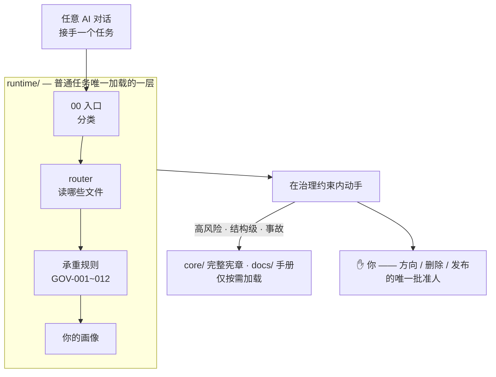
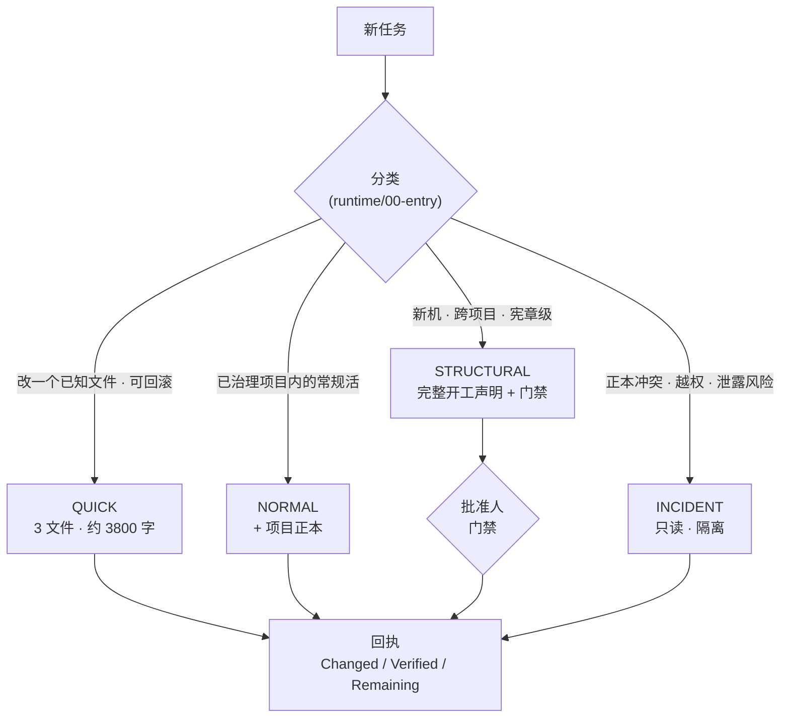

<div align="center">

# 🧭 AI 对话治理框架

### 给你手上的每个 AI 一份共同的事实底本 —— 让它们不再失忆、互相打架、说不清哪份文件才算数。

[](LICENSE)
[](VERSIONS.md)
[](VERSIONS.md)
[](tools/)
[](#)

[English](README.md) · **简体中文**

</div>

---

## 它解决什么

你早就不是只用一个 AI 了 —— Claude 一个窗口、Codex 一个窗口、还有浏览器标签页、同事的会话。每一个都会:

- **忘**了上次定了什么,
- 跟别的助手**互相矛盾**,
- 说不清**哪份文件才算数**,
- 要么什么都不敢碰,要么悄悄做了件不可逆的事。

换个更聪明的模型解决不了。**把事实钉进文件**才行 —— 任何一个 AI 接手时就已经知道:*去哪读、谁说了算、什么还没确认、什么时候该停下问你。*

## 你到手的是什么

|  | 没有它 | 有了这套框架 |
|---|---|---|
| 🔧 **改个错别字** | AI 把整本 14KB 宪章 + 你全部偏好塞进上下文 | 判为 **QUICK** —— 只读 3 个小文件(约 3800 字)就动手 |
| 💻 **换台电脑** | 「项目在哪?谁能提交?哪份是正本?」 | 方法一字不改 —— 你只重填*这台机*的事实 |
| 💬 **多个对话同时开** | 各说各话、互相覆盖、出事说不清 | 一套权威顺序 + 四维状态 + 门禁 —— 每处冲突都可追溯 |
| 📋 **一份进度汇报** | 一大段「我理解了……」,毫无证据 | 三行:**Changed / Verified / Remaining** |

## 怎么运作 —— 两层,一条铁律



完整宪章、你的全套画像、每一本手册都在那儿,但**「存在 ≠ 要读它」**。普通任务永远只加载 runtime 这一层。

## 每个任务先分类,再决定开哪些重文件



两档拿不准?取写入面更小的那一档。一旦涉及不可逆、越权或私密材料,直接进 **INCIDENT**。

## 快速开始 —— 2 分钟

```bash
git clone <你 fork 的本框架仓>
cd governance-framework
python -X utf8 tools/validate_runtime.py    # 先证明它是真的、测过的
```

真实输出:

```text
=== validate_runtime.py ===
  PASS runtime/00-entry.md = 821 chars (<= 1200)
  PASS runtime/01-core-rules.md = 2198 chars (<= 3500)
  PASS runtime/02-user-runtime-profile.md = 784 chars (<= 2000)
  PASS runtime total = 3803 chars (<= 8000)
  ...
--- 11 passed, 0 failed ---
```

然后把日常启动器**整段**贴给任意 AI(Claude / Codex / 任何对话),再给它一个具体任务:

```text
复制 launchers/总管AI-日常启动-v2.txt 全文  →  贴给你的 AI  →  给一个任务
```

## 看它怎么干活

> **你**:帮我把 README 里那个错别字改一下。
>
> **AI(照本框架运行)**:
> 1. 读 `runtime/00-entry.md` → 判为 **QUICK**(一个已知文件、可回滚)
> 2. 只加载那 3 个 runtime 文件 —— **不翻完整宪章**
> 3. 回你三行:
>
> ```text
> Changed:   README.md 第 12 行   "的的" → "的"
> Verified:  已重读该行确认
> Remaining: 无
> ```

没有冗长开工声明,没有整本规则复述。**该轻的地方轻,该停的地方停** —— 只有真正高风险(删除 / 越权 / 公开发布)才升级模式、走门禁、停下来问*你*。

## 它保证的 7 条根本原则

1. **用户是唯一最高决策人** —— 方向、批准、删除、发布终归你。
2. **文档高于对话记忆** —— 给不出来源的,只是待核线索,不是事实。
3. **一事一正本** —— 每类事实只有一个可编辑真相源。
4. **先证明来源,再陈述事实** —— 缺证据就标 `UNKNOWN`,不硬编。
5. **探索与决定分离** —— 只有指定批准人能把草稿升为「已批准」。
6. **没进正式记录,不算完成** —— 无产物 / 验证 / 路径 / 回滚 = 口头完成。
7. **总管有治理权,无无限执行权** —— 协调可以,越权删改不行。

## 目录结构

```text
core/        治理内核 —— 七原则 / 四维状态 / 权威顺序 / 门禁
runtime/     最小加载层 —— 入口 + 承重规则 GOV-001~012 + 用户画像位 + 路由
launchers/   分模式启动 & 手动提示词   ← 复制即用
profiles/    user/ 用户画像模板 · machines/ 机器 Profile 模板
projects/    项目 adapter 协议与模板
adapters/    Claude / Codex / 通用 加载与硬权限适配
templates/   开工声明、任务包、回执、决策记录……
skills/      总管 skill(global-ai-dialogue-governor)
tools/       校验器 —— validate_runtime / validate_paths / validate_release
docs/        专项手册 · 分层导航指南
VERSIONS.md  三个版本维度    ·    AGENTS.md  agent 入口说明
```

## 换台电脑落地(3 步)

1. **原样带走本框架** —— 不改一个字。
2. 复制 `profiles/user/user-profile.template.md` 填成你的画像;用机器 / 项目模板为*这台机*重新发现事实。**填好的实例存进你自己的私有仓 —— 别推回本框架。**
3. `python -X utf8 tools/validate_runtime.py` 自检。

> 复用层与本机层为什么要分开,见 [`docs/分层导航-复用层与本机层.md`](docs/分层导航-复用层与本机层.md)。

## 版本

三个互相独立的维度 —— **治理规范**、**工程接线**、**发布打包** —— 一处只改文档的修补,永远不会冒充成规范变更。见 [VERSIONS.md](VERSIONS.md)。

## 许可

[MIT](LICENSE) —— 暂定,可日后调整。
